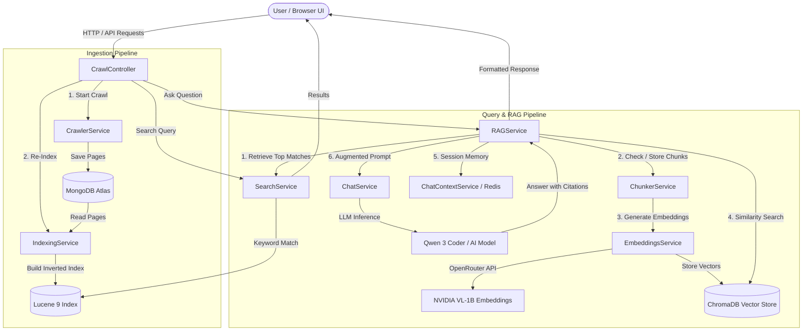

# Tux Search Engine 🔍

[](https://www.oracle.com/java/)
[](https://spring.io/projects/spring-boot)
[](https://lucene.apache.org/)
[](LICENSE)

An intelligent, hybrid AI search and Retrieval-Augmented Generation (RAG) engine designed for developer documentation and technical content. It combines the speed and precision of Apache Lucene full-text indexing with semantic vector embeddings in ChromaDB and multi-turn conversational AI via OpenRouter.

---

## 🌟 Key Features

- **🕷️ Multithreaded Web Crawler**: Concurrent recursive crawling powered by Jsoup with rate limiting, domain boundary enforcement, atomic progress tracking, and URL deduplication.
- **⚡ Apache Lucene 9 Full-Text Engine**: Tokenized BM25 indexing with multi-field querying across page titles and contents, with automatic special-character escaping.
- **🧠 Hybrid "Lazy" RAG Pipeline**: Combines Lucene keyword matching with ChromaDB cosine vector search—generating embeddings dynamically only when needed to optimize cost and performance.
- **💬 Conversational Memory**: Session-based multi-turn chat with thread-safe history buffering, context trimming, and optional Redis caching.
- **🛡️ High Availability & Fallback**: Resilient fallback to MongoDB document text if the vector store is unreachable.
- **🎨 Glassmorphic Web UI**: Modern dark-mode interface built with real-time stats, crawl triggers, live chat, markdown rendering, and code block formatting.

---

## 📐 System Architecture



---

## 🛠️ Technology Stack

| Layer | Technology | Purpose |
|---|---|---|
| **Framework** | Spring Boot 3.5.5 (Web, WebFlux, Data) | Core REST APIs and dependency injection |
| **Full-Text Search** | Apache Lucene 9.9.1 | Inverted index, tokenization, BM25 scoring |
| **Document Store** | MongoDB Atlas | Raw web page metadata and content persistence |
| **Vector Store** | ChromaDB (v2 API) | Dense vector storage and cosine similarity search |
| **Cache & Sessions** | Redis 7 | Vector chunk caching and session context |
| **Embeddings & LLM** | OpenRouter (NVIDIA Nemotron / Qwen) | Text embeddings and generative answering |
| **Web Crawler** | Jsoup + Guava RateLimiter | HTML parsing, link extraction, polite rate limiting |
| **Frontend** | Vanilla HTML5 / CSS3 / JavaScript | Modern dark-mode UI with markdown support |

---

## 🚀 Getting Started

### Prerequisites

- **Java JDK 17+**
- **Docker & Docker Compose** (for Redis and ChromaDB)
- **OpenRouter API Key** (or compatible OpenAI-format API)

### 1. Clone the Repository

```bash
git clone https://github.com/Piyu-shh/dev-docs-search-engine.git
cd dev-docs-search-engine
```

### 2. Start Infrastructure (Redis & ChromaDB)

```bash
docker-compose up -d
```

Verify services:
```bash
docker ps
```

### 3. Configure Environment Variables

Create or edit `.env` in the root directory (or edit `src/main/resources/application.properties`):

```properties
# MongoDB connection
spring.data.mongodb.uri=your_mongodb_connection_string

# Redis
spring.data.redis.host=localhost
spring.data.redis.port=6379

# ChromaDB
chroma.url=http://localhost:8000
chroma.collection.name=web_pages_chunks

# OpenRouter / LLM
openrouter.api.key=your_openrouter_api_key
openrouter.embedding.model=nvidia/llama-nemotron-embed-vl-1b-v2:free
openrouter.chat.model=qwen/qwen3-coder:free
```

### 4. Build and Run

```bash
./mvnw clean spring-boot:run
```

Access the Web UI at **`http://localhost:8080`**.

---

## 📖 API Documentation

### 🕷️ Crawling & Indexing

#### `GET /api/crawl`
Initiates a background recursive web crawl.
- **Parameters**:
  - `startUrl` *(required)*: Target website URL (e.g. `https://spring.io/projects/spring-boot`)
  - `depth` *(optional, default: 2, max: 5)*: Maximum crawl recursion depth
- **Response**: `200 OK` — `"Recursive crawl initiated for: ..."`

#### `GET /api/index`
Builds the Lucene inverted index for all pages in the MongoDB database.
- **Response**: `200 OK` — `"Re-indexing of all crawled pages initiated..."`

---

### 🔍 Search & RAG

#### `GET /api/search`
Executes full-text keyword search across indexed titles and contents.
- **Parameters**: `q` *(required)*: Search terms
- **Response**:
```json
[
  {
    "url": "https://spring.io/projects/spring-boot",
    "title": "Spring Boot Documentation"
  }
]
```

#### `GET /api/ask`
Generates an AI-synthesized answer with source citations using RAG and conversation context.
- **Parameters**:
  - `q` *(required)*: User question
  - `sessionId` *(optional)*: Unique session ID for maintaining conversational memory
- **Response**:
```json
{
  "answer": "Spring Boot makes it easy to create stand-alone, production-grade Spring based Applications...",
  "sources": [
    {
      "url": "https://spring.io/projects/spring-boot",
      "title": "Spring Boot Documentation"
    }
  ]
}
```

---

### 💬 Session & Vector DB Management

| Endpoint | Method | Description |
|---|---|---|
| `/api/chat/history?sessionId=...` | `GET` | Retrieve conversation history for a given session |
| `/api/chat/clear?sessionId=...` | `GET` | Clear conversation history for a session |
| `/api/vector-db/stats` | `GET` | Return ChromaDB collection chunk statistics |
| `/api/vector-db/clear` | `GET` | Clear and recreate the vector database collection |
| `/api/health` | `GET` | Health check endpoint with vector status |

---

## 🧪 Running Tests

Execute the automated test suite with Maven:

```bash
./mvnw test
```

---

## 📄 License

This project is licensed under the MIT License.
